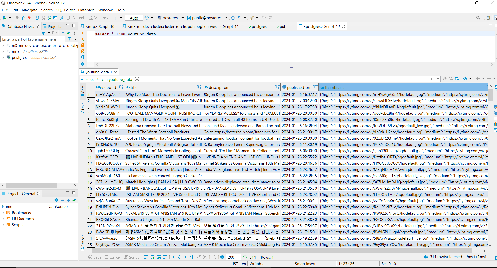
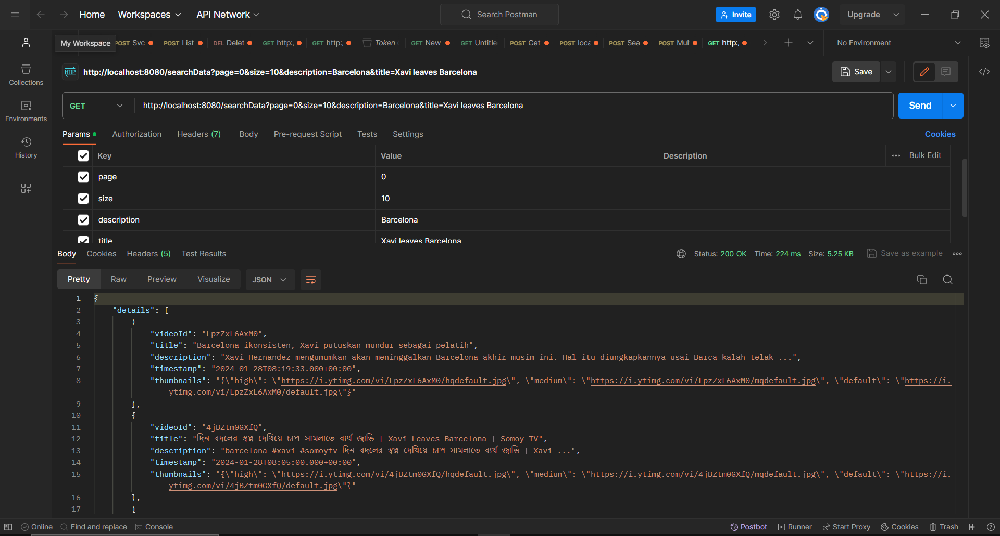

# FamPay Assignment

An API to fetch the latest videos sorted in reverse chronological order of their publishing date-time from YouTube for a given tag/search query in a paginated response.

## Getting Started

### Prerequisites

- [Java](https://www.java.com/) (version 8 or higher)
- [Maven](https://maven.apache.org/)
- PostgreSQL Database

### Database Setup

1. Install PostgreSQL and create a database named "postgres".
2. Create a user with the following credentials:

    ```yaml
        url: "jdbc:postgresql://localhost:5432/postgres"
        username: "postgres"
        password: "root"
    ```

### Build and Run

```bash
# Clone the repository
git clone https://github.com/Rohitn697/FamPayAssignment.git

# Navigate to the project directory
cd FamPayAssignment

# Build the project
mvn clean install

# Run the service
mvn spring-boot:run


### Build and Run
The service will be available at http://localhost:8080.

# Build the Docker image
docker build -t fampay-assignment .

# Run the Docker container
docker run -p 8080:8080 fampay-assignment
```

## Endpoints

#### `GET http://localhost:8080/searchData?page=0&size=10&description=Barcelona&title=Xavi leaves Barcelona`

**Example Response:**

```json
{
   "details": [
      {
         "videoId": "LpzZxL6AxM0",
         "title": "Barcelona ikonsisten, Xavi putuskan mundur sebagai pelatih",
         "description": "Xavi Hernandez mengumumkan akan meninggalkan Barcelona akhir musim ini. Hal itu diungkapkannya usai Barca kalah telak ...",
         "timestamp": "2024-01-28T08:19:33.000+00:00",
         "thumbnails": "{\"high\": \"https://i.ytimg.com/vi/LpzZxL6AxM0/hqdefault.jpg\", \"medium\": \"https://i.ytimg.com/vi/LpzZxL6AxM0/mqdefault.jpg\", \"default\": \"https://i.ytimg.com/vi/LpzZxL6AxM0/default.jpg\"}"
      },
      {
         "videoId": "4jBZtm0GXfQ",
         "title": "দিন বদলের স্বপ্ন দেখিয়ে চাপ সামলাতে ব্যর্থ জাভি | Xavi Leaves Barcelona | Somoy TV",
         "description": "barcelona #xavi #somoytv দিন বদলের স্বপ্ন দেখিয়ে চাপ সামলাতে ব্যর্থ জাভি | Xavi ...",
         "timestamp": "2024-01-28T08:05:00.000+00:00",
         "thumbnails": "{\"high\": \"https://i.ytimg.com/vi/4jBZtm0GXfQ/hqdefault.jpg\", \"medium\": \"https://i.ytimg.com/vi/4jBZtm0GXfQ/mqdefault.jpg\", \"default\": \"https://i.ytimg.com/vi/4jBZtm0GXfQ/default.jpg\"}"
      },
      {
         "videoId": "Gq36IYSUKZk",
         "title": "xavi akan meninggalkan barcelona akhir musim ini",
         "description": "xavi akan meninggalkan barcelona akhir musim ini, Xavi hernandez, xavi out, barcelona ...",
         "timestamp": "2024-01-28T05:28:15.000+00:00",
         "thumbnails": "{\"high\": \"https://i.ytimg.com/vi/Gq36IYSUKZk/hqdefault.jpg\", \"medium\": \"https://i.ytimg.com/vi/Gq36IYSUKZk/mqdefault.jpg\", \"default\": \"https://i.ytimg.com/vi/Gq36IYSUKZk/default.jpg\"}"
      },
      {
         "videoId": "CvOgmQs4OSM",
         "title": "ഇനി നിങ്ങൾ എന്നെ കൊല്ലില്ലല്ലോ....! രാജി പ്രഖ്യാനം നടത്തി ചാവി പറഞ്ഞത് | Xavi | FC Barcelona",
         "description": "Xavi Hernandez FC Barcelona vs Villarreal Follow Us : Raf Talks APP ...",
         "timestamp": "2024-01-28T03:45:00.000+00:00",
         "thumbnails": "{\"high\": \"https://i.ytimg.com/vi/CvOgmQs4OSM/hqdefault.jpg\", \"medium\": \"https://i.ytimg.com/vi/CvOgmQs4OSM/mqdefault.jpg\", \"default\": \"https://i.ytimg.com/vi/CvOgmQs4OSM/default.jpg\"}"
      },
      {
         "videoId": "tUPsKakfqVs",
         "title": "BARCELONA IS FINISHED - Xavi Leaving",
         "description": "Xavi Hernández announces he will leave Barcelona at end of season after 5-3 loss to Villarreal. Xavi confirmed the news ...",
         "timestamp": "2024-01-28T03:30:31.000+00:00",
         "thumbnails": "{\"high\": \"https://i.ytimg.com/vi/tUPsKakfqVs/hqdefault.jpg\", \"medium\": \"https://i.ytimg.com/vi/tUPsKakfqVs/mqdefault.jpg\", \"default\": \"https://i.ytimg.com/vi/tUPsKakfqVs/default.jpg\"}"
      },
      {
         "videoId": "o8bYrK-5wYM",
         "title": "XAVI, optimista de pensar llegará a junio. ERA INSOSTENIBLE y sin argumentos, Barak | Fuera de Juego",
         "description": "Xavi Hernández, tras la derrota del Barcelona ante el Villarreal, anunció que dejará su puesto en el banquillo del club al acabar ...",
         "timestamp": "2024-01-28T03:15:02.000+00:00",
         "thumbnails": "{\"high\": \"https://i.ytimg.com/vi/o8bYrK-5wYM/hqdefault.jpg\", \"medium\": \"https://i.ytimg.com/vi/o8bYrK-5wYM/mqdefault.jpg\", \"default\": \"https://i.ytimg.com/vi/o8bYrK-5wYM/default.jpg\"}"
      },
      {
         "videoId": "CqDbM2JvuWk",
         "title": "IS IT THE RIGHT MOVE FROM XAVI AND BARCA? IS XAVI OUR BIGGEST PROBLEM?",
         "description": "Turn your videos into live streams with Restream https://restre.am/ANIm #xavi #barcelona #football.",
         "timestamp": "2024-01-28T03:11:17.000+00:00",
         "thumbnails": "{\"high\": \"https://i.ytimg.com/vi/CqDbM2JvuWk/hqdefault.jpg\", \"medium\": \"https://i.ytimg.com/vi/CqDbM2JvuWk/mqdefault.jpg\", \"default\": \"https://i.ytimg.com/vi/CqDbM2JvuWk/default.jpg\"}"
      },
      {
         "videoId": "3dQvS0vahqU",
         "title": "Match Review: Embarrasing Performance &amp; Resignation of Xavi",
         "description": "Match analysis of La Liga clash between FC Barcelona and Villarreal. Place your sports bets at: https://bit.ly/barcanews-BetUS Get ...",
         "timestamp": "2024-01-28T02:46:01.000+00:00",
         "thumbnails": "{\"high\": \"https://i.ytimg.com/vi/3dQvS0vahqU/hqdefault.jpg\", \"medium\": \"https://i.ytimg.com/vi/3dQvS0vahqU/mqdefault.jpg\", \"default\": \"https://i.ytimg.com/vi/3dQvS0vahqU/default.jpg\"}"
      },
      {
         "videoId": "Zz6SmIiGkYk",
         "title": "XAVI LEAVES BARCELONA!!!",
         "description": "Published on: 28th January 2024 Xavi Hernandez has decided to leave Barcelona at the end of the season. Was this a good ...",
         "timestamp": "2024-01-28T02:30:14.000+00:00",
         "thumbnails": "{\"high\": \"https://i.ytimg.com/vi/Zz6SmIiGkYk/hqdefault.jpg\", \"medium\": \"https://i.ytimg.com/vi/Zz6SmIiGkYk/mqdefault.jpg\", \"default\": \"https://i.ytimg.com/vi/Zz6SmIiGkYk/default.jpg\"}"
      },
      {
         "videoId": "GY2IPE-21Wg",
         "title": "🚨 ÚLTIMA HORA BARÇA 💣 BOMBAZO - XAVI SE MARCHA💥 FC BARCELONA 3-5 VILLARREAL | OTRO MAL ARBITRAJE",
         "description": "ÚLTIMA HORA BARÇA BOMBAZO - XAVI SE MARCHA   FC BARCELONA 3-5 VILLARREAL | OTRO MAL ARBITRAJE ...",
         "timestamp": "2024-01-28T02:21:56.000+00:00",
         "thumbnails": "{\"high\": \"https://i.ytimg.com/vi/GY2IPE-21Wg/hqdefault.jpg\", \"medium\": \"https://i.ytimg.com/vi/GY2IPE-21Wg/mqdefault.jpg\", \"default\": \"https://i.ytimg.com/vi/GY2IPE-21Wg/default.jpg\"}"
      }
   ],
   "currentPage": 0,
   "totalItems": 38,
   "totalPages": 4
}
```

## Database & Postman Instances
**Data Stored in Postgres Database after Hitting Youtube Data API.**


**Response Object of the endpoint after passing search criteria in the queryParams in paginated view:**


## Testing

### Unit Tests
Unit tests are provided in the code to ensure correct functionality with line coverage.

Run unit tests:

```bash
mvn test
```
